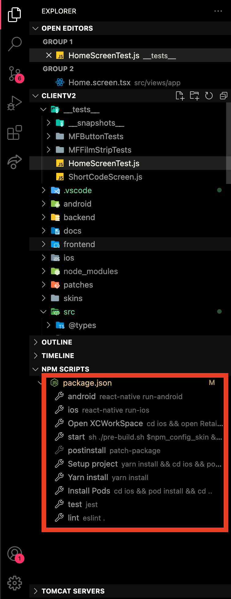
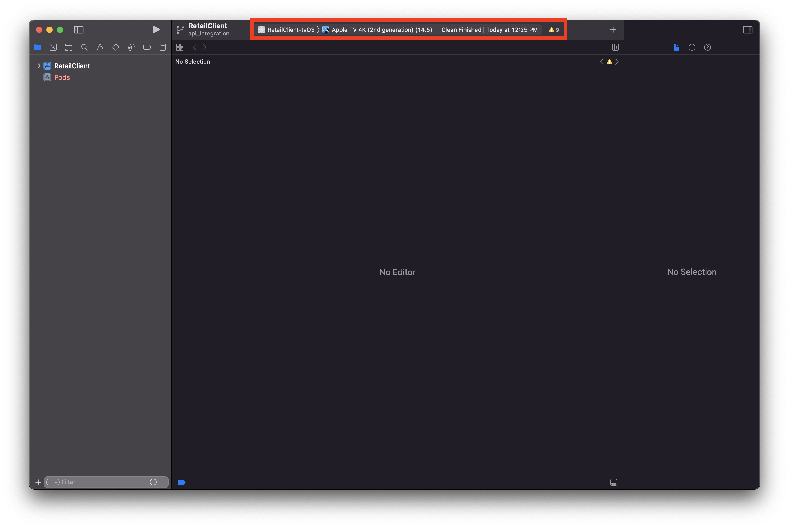
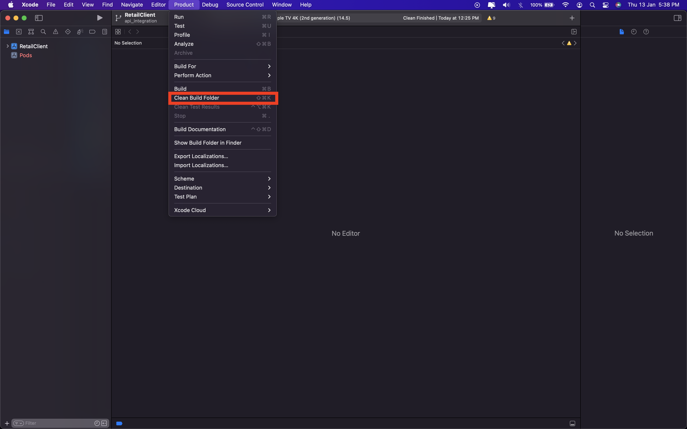

# Introduction

Retail Client v3 is an enhanced version of Retail Client v2, developed exclusively for Apple TV with Typescript, React-Query and Native codebase (Objective-C and Swift).Performance and quality of the application have risen several times since switching to pure Typescript with React-Query and removing You.I framework's needs and dependencies.

## Table of Contents

- [Project Setup](#project-setup)
- [Build and Run](#build-and-run)
- [Configuration and Styling](#configuration-and-styling)
- [Common Issues](#common-issues)
- [Writing and Running Tests](#writing-and-running-tests)

## Project Setup

### Prerequisites

- [Node.js > 12](https://nodejs.org) and npm
- [Xcode 13](https://developer.apple.com/xcode)
- [Cocoapods >= 1.11.2](https://cocoapods.org)

To setup the project, clone this repo to destination folder. Run `yarn install` to install all dependencies. Swtich to iOS folder using `cd ios` command and `pod install` to install the Podfile dependencies.

NPM scripts to perform setup actions are available in `NPM Scripts` section. The scripts can also be used as an alternative to manual setup.

## Build and Run

Note: The scheme `RetailClient-tvOS` is exclusive for simultor runtime while the scheme `RetailClient-tvOS_Player` is exlusive for physical TV device

To build and run the project,

1. Open XCode
2. Select TVOS in schemes in section
   
3. Clean build folder (Product tab -> Clean Build folder or CMD + Shift + K)
   
4. Hit `Run` Button to launch the application on Simulator or connected Apple TV.

## Configuration and Styling

Styling and Customisation in Client v3 application are driven through `uidefinition.json` and `config.ts` files. Each folder inside skins folder represents an operator supported by Client v3 application and each operator has specifically configured UI styling and configuration settings, which are stored in these files.

When building or running the app for a specific operator, all the files in that specific operator's folder are copied into `src/config/` and `src/assets/` folder.

For parsing `uidefinition.json`, the NPM script `uidef` is executed using `yarn run uidef` or by using NPM scripts tag in VSCode. This parses the `uidefinition.json`, cleans up the comments and replaces template strings with values. This creates the `uidefinition.parsed.json` inside `src/config/` folder.

All the CSS styles used in Client v3 application are derived from `uidefinition.json` while providing fallback styles incase no styles are specified in `uidefinition.json`.

## Changing environment

To build the app for a different environment (default is devtest "https://reachclient.dev.mr.tv3cloud.com/"), the following process is required:

- Open `backend/globals.ts`
- The line `let url = "https://reachclient.dev.mr.tv3cloud.com/";` should be replaced by required url
- An uninstall and clean install of the app is required for the new env change is applied

## Generate production version

These are the steps to generate `.ipa` files

1. Go to the Xcode
2. Select the schema
3. Select 'Any iOS device' as target
4. Product -> Archive

For more info please go to https://reactnative.dev/docs/publishing-to-app-store

## Common Issues

In this section, we'll list down some of the common issues in running the project

1. `Invalid Podfile file`: Cannot load such file --` /Users/user/ClientV2/node_modules/react-native/scripts/react_native_pods`

This issue is encountered during Pods installation when `node_modules` are not properly setup. To fix this,

- delete `Podfile.lock`
- run `yarn audit` and
- `yarn install`

> yarn audit / yarn install --audit has been available since yarn@1.12.0

## Writing and Running Tests

This project is set up to use [jest](https://facebook.github.io/jest/) for tests. You can configure whatever testing strategy you like, but jest works out of the box. Create test files in directories called `__tests__` or with the `.test` extension to have the files loaded by jest. See the [the template project](https://github.com/react-community/create-react-native-app/blob/master/react-native-scripts/template/App.test.js) for an example test. The [jest documentation](https://facebook.github.io/jest/docs/en/getting-started.html) is also a wonderful resource, as is the [React Native testing tutorial](https://facebook.github.io/jest/docs/en/tutorial-react-native.html).

<!-- # Contribute
TODO: Explain how other users and developers can contribute to make your code better.

If you want to learn more about creating good readme files then refer the following [guidelines](https://docs.microsoft.com/en-us/azure/devops/repos/git/create-a-readme?view=azure-devops). You can also seek inspiration from the below readme files:
- [ASP.NET Core](https://github.com/aspnet/Home)
- [Visual Studio Code](https://github.com/Microsoft/vscode)
- [Chakra Core](https://github.com/Microsoft/ChakraCore) -->
